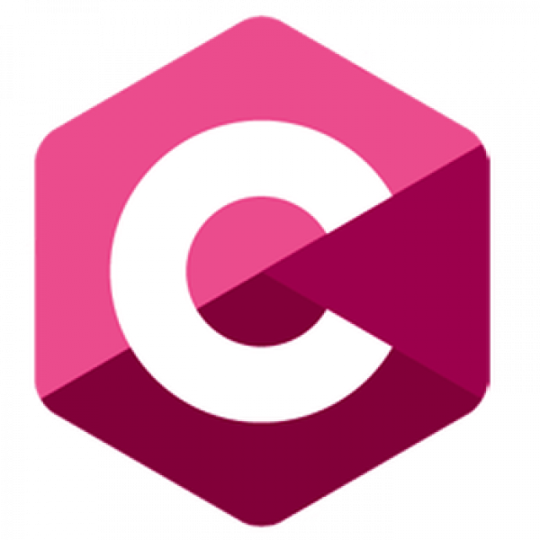

<!--
### Hi there 👋
**specter25/specter25** is a ✨ _special_ ✨ repository because its `README.md` (this file) appears on your GitHub profile.

Here are some ideas to get you started:

- 🔭 I’m currently working on ...
- 🌱 I’m currently learning ...
- 👯 I’m looking to collaborate on ...
- 🤔 I’m looking for help with ...
- 💬 Ask me about ...
- 📫 How to reach me: ...
- 😄 Pronouns: ...
- ⚡ Fun fact: ...
-->

### Hey 👋🏽, I'm Aman Kumar 

 

 

Hi, I'm Aman Kumar a Computer science freak. I am a Full Stack Web Developer 🚀 from India. Currently exploring Cloud Computing and Devops. Upcoming Software Engineer [@SummitTechGrp](https://thesummitgrp.com/). Ex-Frontend Engineer [@gamezop](https://www.gamezop.com/), Ex-Full Stack Engineer [@prepseed](https://www.linkedin.com/company/prepseed/) & [@pathshala](https://www.linkedin.com/company/pathshalaonweb/). Technical Secretary [@Owasp-tiet](https://github.com/OWASP-STUDENT-CHAPTER), Tech Team member at [SAIC-TIET](https://github.com/StudentAluminiInteractionCell) and Member of Technical and Software Department in [GirlScript](https://github.com/girlscript) . Beside's programming, I enjoy playing and producing music .

  
**Talking about Personal Stuffs:**

- 👨🏽‍💻 I’m currently working on [E-Adalat](https://github.com/amankumar11/e-court-HackPrinceton);
- 🌱 I’m currently learning Cloud Computing
- 👯 I’m looking to collaborate on Web Dev projects 🤝;
- 🤔 I’m looking for help with LLD and Cloud;
- 💬 Ask me about anything, I am happy to help;
- ⚡️ Fun Fact: Making projects is the best way to learn 📚
- 📫 How to reach me: aman.kumar11112001@gmail.com;
<!-- - 📝[Resume](https://drive.google.com/file/d/1TIgJ7rDBUYSkbs_QNcIEttJ5BFaIW3nn/view) -->

**Languages and Tools:**  

<code></code>
<code></code>
<code></code>
<code></code>
<code></code>
<code></code>
<code></code>
<code></code>
<code></code>
<code></code>
<code></code>
<code></code>
<code></code>
<code></code>
<code></code>
<code></code>
<code></code>
<code></code>
<code></code>

<!-- <code></code>
<code></code> -->

<!--   --!>
  
  

  
